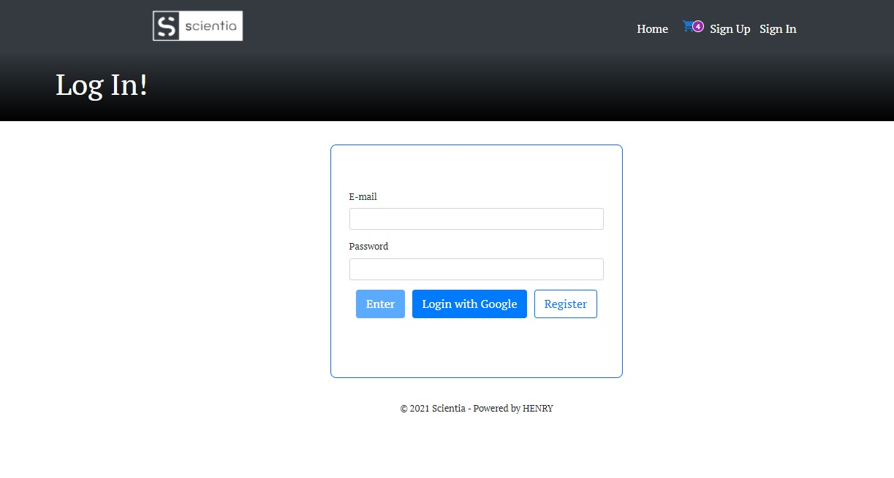

# SCientia App -Online Learning-

FrontEnd: React / Redux / Material UI / Bootstrap

BackEnd: Node JS / Express / Sequelize 

DataBase: Postgres

Payment: Credit Card (Mercado Pago API)

Authentication: Firebase Authentication (Auth0)

Notifications: Nodemailer (EJS)

Others: Cloudinary

### Objective

- Apply best practices
- GitHub Organization workflow
- Deploy Heroku/Vercel

## App Topic

The main reason of this App, its allow users to share they own video courses, sell/buy, create their own courses and others related with.

#### Technologies applied:

- [ ] React
- [ ] Redux
- [ ] Material UI
- [ ] Bootstrap
- [ ] HTML / CSS
- [ ] NodeJS
- [ ] Express
- [ ] Sequelize
- [ ] Postgres

### LANDING:

  

### HOME:

  

### CART:

  

### LOGIN:

  

### MyLearning Path:

  

### Player:

  

### USER Profile:

  

